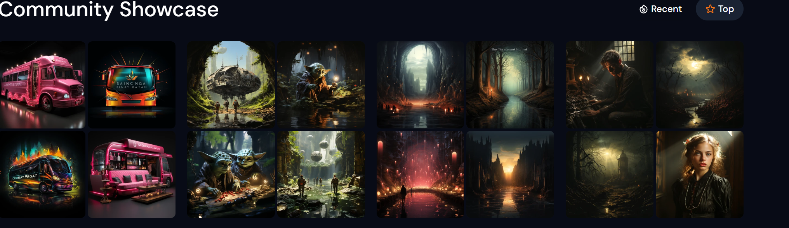

## Introduction

In recent years, artificial intelligence (AI) has brought forth a remarkable transformation in the world of digital art and creativity. One of the fascinating aspects of AI's creative capabilities is the generation of lifelike images. These AI-generated images have opened up new frontiers for artists, designers, and content creators, revolutionizing the creative process. In this blog post, we will delve into the world of AI-generated images, exploring how they are created, their applications, and the implications of this creative revolution.

## What are AI-Generated Images?

AI-generated images are digital visuals created by artificial intelligence systems using complex algorithms and deep learning techniques. These AI models, particularly Generative Adversarial Networks (GANs), have become the driving force behind generating compelling, realistic images. GANs consist of two neural networks: the generator, which creates images, and the discriminator, which evaluates the authenticity of those images. Through a continuous feedback loop, GANs refine their creations until they produce images that closely resemble real-world photographs.

## The Creative Process of AI-Generated Images

The creative process of AI-generated images is both fascinating and mysterious. It begins with the training of GANs on vast datasets of real images. As the generator learns to produce new images, the discriminator provides feedback, pushing the generator to improve its creations continuously. This adversarial relationship between the two networks is what drives the refinement of the generated images. With each iteration, the AI model learns and evolves, ultimately producing images that possess stunning levels of detail, realism, and artistic flair.

## Applications of AI-Generated Images

The applications of AI-generated images span across various industries and creative fields:

1. **Art and Design**: AI-generated images have become a powerful tool for artists and designers to explore new styles and concepts. These AI models can create artworks that blend various artistic styles, resulting in captivating and innovative pieces.

2. **Content Creation**: In the realm of content creation, AI-generated images offer a wealth of possibilities. From generating visuals for blog posts and social media to creating unique illustrations and infographics, AI-generated images streamline the creative process and inspire content creators.

3. **Video Games and Animation**: AI-generated images have found their way into the gaming and animation industries. Game developers use AI-generated assets to enhance virtual environments, while animators leverage AI-generated characters and backgrounds to streamline production.

4. **Stock Photography**: AI-generated images provide a vast pool of unique stock photography options, allowing businesses and content creators to find fresh and eye-catching visuals for their projects.

## Some Popular AI Image Generators

### [DALL-E 2](https://openai.com/dall-e-2)

The most known and advanced generator available, maybe a bit overhyped. It's very easy to use and generate realistic and detailed images.
Openai continue to add powerfull features like the [image editor](https://help.openai.com/en/articles/6516417-dall-e-editor-guide).

Cost: 115 credits cost 15$. 
Check [Openai website](https://openai.com/pricing) for the latest pricing details..

### [Dream Studio](https://beta.dreamstudio.ai/)
A budget friendly alternative to DALL-2 and powered by Stable Diffusion an [open-source](https://github.com/Stability-AI/stablediffusion) model!

Cost: Free trial credit and then ~5000 image 10$.

#### Example using this prompt (SDXL v1.0): Cute dear eating ice cream

{{< carousel images="{gallery/dreamstudio1.png,gallery/dreamstudio2.png,gallery/dreamstudio3.png,gallery/dreamstudio4.png}" interval="2500" >}}

### [Midjourney](https://www.midjourney.com/)

It is accessible using discord and provide very hight quality image. At this time a free trial is not available.
Cost: ~200 credit cost 10$ billed monthly or 8$ billed yearly

### [Bing Image Creator](https://www.bing.com/create)

Microsoft Image creator based on DALL-E it's still in preview and provide a free plan with limited "boosts" (faster generation).

#### Example using this prompt: Cute dear eating ice cream

{{< carousel images="{gallery/bing-Dall-E1.jpg,gallery/bing-Dall-E2.jpg,gallery/bing-Dall-E3.jpg,gallery/bing-Dall-E4.jpg}" interval="2500">}}

## Selection Criteria

Selecting the perfect one for your needs can be a challenging endeavor. Here are few key features to consider:

1. **Ease of Use**: A user-friendly interface can make all the difference in your creative experience. Seek generators that are accessible to both tech-savvy artists and newcomers alike.

2. **Image Quality**: Assess the generator's capability in producing clear, detailed, and realistic images.

3. **Customization**: Seek generators that empower you with complete control over the final result. Can you specify the style, composition, variations...

4. **Cost**: Explore the options that align with your financial preferences. Is there a free or cost-effective choices available.

## Ethical Considerations

Despite their creative potential, AI-generated images also raise ethical concerns. The increasing realism of these images blurs the line between real and fake, potentially leading to misinformation and deepfake-related issues. It is crucial to use AI-generated images responsibly and be transparent about their origin to maintain ethical standards.

## Conclusion

AI-generated images mark a new era in creativity, showcasing the tremendous potential of artificial intelligence in the realm of digital art and design. As technology continues to advance, we can expect AI models to create even more breathtaking and thought-provoking visuals. Nevertheless, it is essential to approach this creative revolution with caution, ensuring ethical use and responsible deployment of AI-generated images. By embracing AI's capabilities responsibly, we can unlock a world of endless creative possibilities and push the boundaries of human imagination.

{{ partial "disqus.html" . }}
