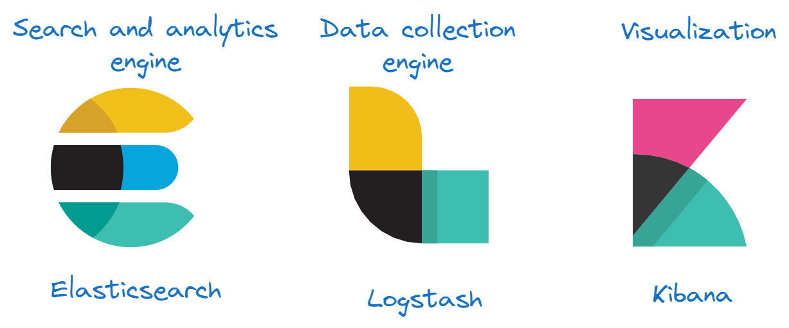
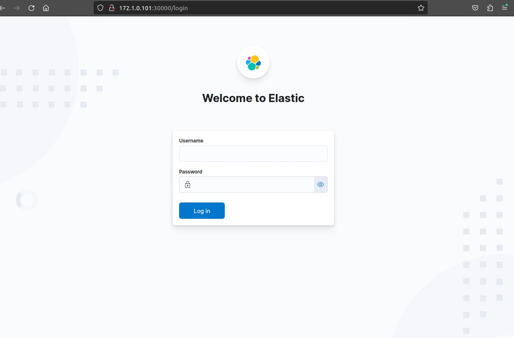
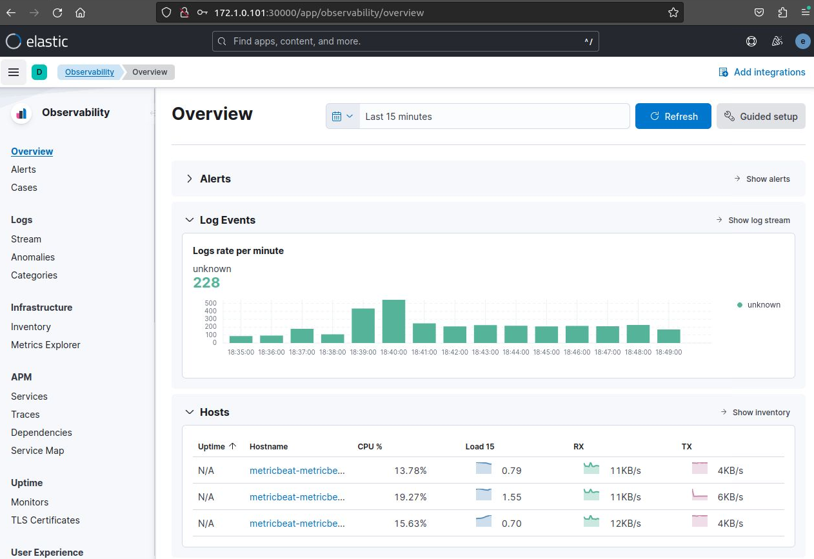
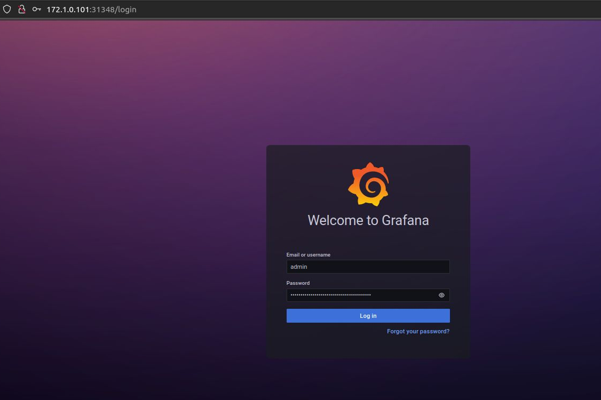
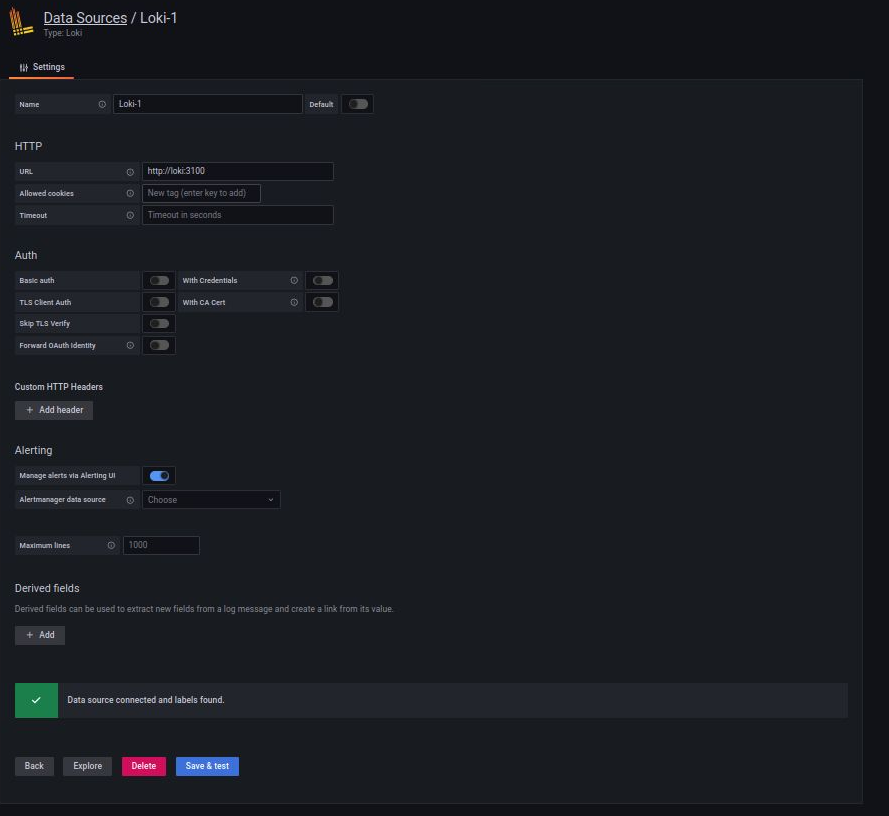
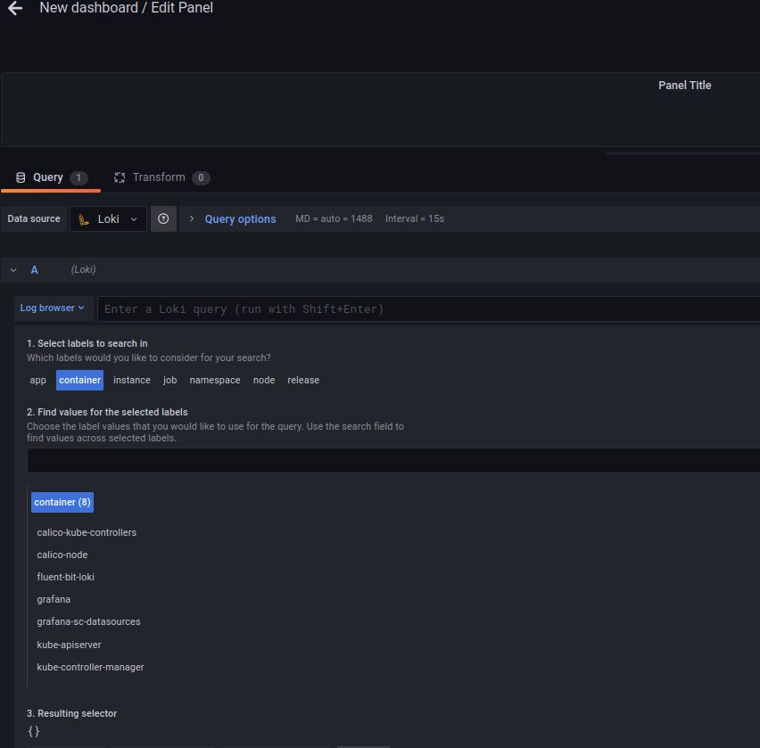

In the dynamic landscape of modern software development, maintaining the health and performance of complex systems is paramount. Enter **observability**, is a concept that has gained significant traction in recent years as applications become more intricate and distributed. In this blog post, we'll delve into what observability is, why it's crucial in a distributed system, and explore some popular tools and design patterns used to achieve observability. We then finish with a hands-on exercise of deploying an observability stack in **Kubernetes**.

## Understanding Observability: A Primer

**Observability** refers to the capability of gaining insights into the internal states of a system by analyzing its external outputs. Unlike monitoring, which typically focuses on specific metrics, observability aims to provide a holistic view of a system's behavior and performance. This concept is particularly relevant in distributed systems due to the inherent complexity and challenges of managing and maintaining such systems. Following are some of its use cases highlighting its significance:

### Diagnosing Issues

In distributed systems, identifying the root causes of problems can prove exceedingly challenging. Observability steps in by providing insights into the interactions, dependencies, and various components at play, leading to quicker and more accurate troubleshooting efforts.

### Understanding Performance

Distributed systems can often fall prey to performance bottlenecks that may not be immediately apparent within individual components. Observability tools step in to closely monitor and analyze the holistic performance of the entire system, ensuring optimal user experiences.

### Proactive Monitoring

Observability allows for the proactive monitoring of systems. Rather than waiting for failures to manifest, teams can detect anomalies and unusual patterns early on, enabling swift action to mitigate potential issues before they escalate.

### Dynamic Environments

Given the prevalence of containers, microservices, and cloud resources, distributed systems frequently experience dynamic scaling. Observability tools are built to adapt to these fluctuations, offering insights into the ever-evolving infrastructure.

### End-to-End Insights

A comprehensive perspective of a distributed system is crucial in understanding how diverse components interact to deliver services. Observability provides these end-to-end insights, which are instrumental in maintaining seamless user experiences.

### Service-Level Agreements (SLAs)

Meeting SLAs can be a significant challenge in distributed systems. Observability comes to the rescue by closely monitoring metrics that directly impact SLAs, enabling teams to take corrective measures and avert violations.

### Scalability

As distributed systems expand, scalability becomes a top concern. Observability tools diligently track performance metrics as systems scale, ensuring the infrastructure remains capable of handling heightened workloads.

### Reducing Downtime

Armed with real-time insights and predictive analytics, observability contributes to minimizing downtime. By rapidly identifying issues and facilitating swift responses, it becomes a linchpin in sustaining uninterrupted operations.

### Continuous Improvement

Observability nurtures a culture of continuous improvement. Armed with historical data, teams can optimize performance, learn from past experiences, and make informed decisions for system enhancements.

### Data-Driven Decisions

The wealth of observability data becomes a valuable resource for data-driven decisions regarding resource allocation, infrastructure adjustments, and overarching architectural improvements.

### Security and Compliance

Observability tools extend their reach to encompass security event monitoring, audit log analysis, and activities tied to regulatory compliance. This translates to a more secure and compliant distributed system.

### Feedback Loop

An integral feedback loop is established between development and operations teams through observability. Developers gain valuable insights into the impact of their code on the system, expediting iterative development cycles and fostering ongoing improvements.

In essence, observability empowers engineering, DevOps teams, and system administrators with the insights necessary to ensure the stability, performance, and reliability of intricate distributed systems. This capability equips organizations to effectively manage the intricacies of contemporary architectures and deliver high-caliber services to end-users.

## Tools for Observability

1. **Prometheus**: A leading open-source monitoring and alerting toolkit, Prometheus scrapes metrics from various components in Kubernetes clusters. It stores and processes these metrics, allowing users to create custom dashboards and set up alerts based on defined thresholds.

2. **Grafana**: Grafana complements Prometheus by offering a flexible visualization platform. It lets you create interactive, customizable dashboards that display Prometheus metrics and other data sources.

3. **Jaeger**: For distributed tracing, Jaeger is a popular choice. It helps track requests as they flow through microservices, identifying latency bottlenecks and aiding in root cause analysis.

4. **Loki**: A log aggregation system, Loki assists in storing and exploring logs. It works well with Kubernetes clusters and can be integrated with Prometheus for powerful log-based queries.

5. **Zipkin**: Another distributed tracing system that helps gather timing data needed to troubleshoot latency problems in service architectures.

6. **ELK Stack (Elasticsearch, Logstash, Kibana)**: Elasticsearch is used for storing and indexing logs, Logstash for collecting and processing logs, and Kibana for visualizing and exploring log data.

7. **Dynatrace**: A comprehensive observability platform that provides APM, infrastructure monitoring, and real user monitoring (RUM) to give insights into application and infrastructure performance.

8. **Datadog**: A cloud-based monitoring and analytics platform that offers APM, infrastructure monitoring, log management, and synthetic monitoring for distributed systems.

9. **Sysdig**: A platform that provides container monitoring, security, and forensics capabilities for containerized and cloud-native environments.

10. **OpenTelemetry**: An open-source project that provides APIs, libraries, agents, and instrumentation to enable observability in applications, helping to generate and collect distributed traces and metrics.

11. **Instana**: A platform that automatically discovers and monitors applications, microservices, and infrastructure, providing real-time insights into the health and performance of distributed systems.

12. **Wavefront**: A cloud-native monitoring and analytics platform that offers observability for applications, containers, and infrastructure through metrics, histograms, traces, and span data.

13. **New Relic**: A commercial observability platform that offers application performance monitoring (APM), infrastructure monitoring, and synthetic testing capabilities for distributed systems.

## Design Patterns for Observability in Kubernetes

1. **Instrumentation**: Injecting code into applications to generate relevant metrics, logs, and traces. This can be done using libraries or frameworks tailored to your language.

2. **Sidecar Pattern**: Deploying a separate container (sidecar) within the same pod as your application container to collect metrics, logs, or traces. This approach avoids interfering with your app's core logic.

3. **Adapter Pattern**: Using an adapter to convert telemetry data from one format to another. For instance, converting application logs into metrics that can be easily analyzed.

4. **Golden Signals**: Monitoring four key metrics—latency, traffic, errors, and saturation—to gain a comprehensive understanding of system health and performance.

5. **Service Mesh**: Implementing a service mesh like Istio or Linkerd can help manage observability tasks like tracing, traffic control, and encryption, across your microservices architecture.

## Hands-on

We explore two observability stacks in Kubernetes first ELK and then we incrementally build one using Grafana tools.

**_NOTE:_** Instructions in this section are intended for testing and evalutation only and do not satisfy most of production requirements.

### Prerequisits

#### Kubernetes cluster

In this Hands-on we will be using a [kubespray](https://github.com/kubernetes-sigs/kubespray) cluster. Minikube can be used instead.


```bash
>kubectl get nodes
NAME    STATUS   ROLES           AGE     VERSION
kub-1   Ready    control-plane   2d23h   v1.27.4
kub-2   Ready    <none>          2d23h   v1.27.4
kub-3   Ready    <none>          2d23h   v1.27.4
```

#### Helm


```bash
> curl -fsSL -o get_helm.sh https://raw.githubusercontent.com/helm/helm/master/scripts/get-helm-3
> chmod 700 get_helm.sh
> ./get_helm.sh
```

### ELK Stack on Kubernetes



#### Deploy Elasticsearch

In my cluster, I am using Rancher [local path provisioner](https://github.com/rancher/local-path-provisioner)

Create values.yaml

```yaml
# Shrink default JVM heap.
esJavaOpts: "-Xmx128m -Xms128m"

# Allocate smaller chunks of memory per pod.
resources:
  requests:
    cpu: "100m"
    memory: "512M"
  limits:
    cpu: "1000m"
    memory: "512M"

# Request smaller persistent volumes and use "local-path" as storageClassName
volumeClaimTemplate:
  accessModes: [ "ReadWriteOnce" ]
  storageClassName: "local-path"
  resources:
    requests:
      storage: 100M
```

```bash
>helm repo add elastic https://helm.elastic.co
>helm install elasticsearch elastic/elasticsearch -f ./values.yaml --namespace=elk --namespace=elk   --create-namespace --wait
```

For `Minikube` make sure to enable `storage-provisioner` addon:

```bash
>minikube addons enable default-storageclass
>minikube addons enable storage-provisioner
```

Use the example [value.yaml](https://raw.githubusercontent.com/LianDuanTrain/Helm3/master/3%20Helm%20Deep%20Dive/elasticsearch/minikube/values.yaml) from the helm repo.

```bash
>wget https://raw.githubusercontent.com/LianDuanTrain/Helm3/master/3%20Helm%20Deep%20Dive/elasticsearch/minikube/values.yaml
>helm install elasticsearch elastic/elasticsearch -f ./value.yaml --namespace=elk   --create-namespace --wait
```

Verify running pods:

```bash
>kubectl get pods -n
NAME                     READY   STATUS    RESTARTS   AGE
elasticsearch-master-0   1/1     Running   0          8m52s
elasticsearch-master-1   1/1     Running   0          8m52s
elasticsearch-master-2   1/1     Running   0          8m52s
```

Expose service:

```bash
>kubectl port-forward -n elk svc/elasticsearch-master 9200
```

Get elastic username and password

```bash
>kubectl get secrets --namespace=elk elasticsearch-master-credentials -ojsonpath='{.data.username}' | base64 -d
>kubectl get secrets --namespace=elk elasticsearch-master-credentials -ojsonpath='{.data.password}' | base64 -d
```

Replace `username` and `password` in the curl command with the values from the commands above.

```bash
>curl -u <username>:<password>-i -H 'Accept:application/json' https://localhost:9200 -k
HTTP/1.1 200 OK
X-elastic-product: Elasticsearch
content-type: application/json
content-length: 548

{
  "name" : "elasticsearch-master-1",
  "cluster_name" : "elasticsearch",
  "cluster_uuid" : "r6d0vqVEQ7usXXSpKjBxgA",
  "version" : {
    "number" : "8.5.1",
    "build_flavor" : "default",
    "build_type" : "docker",
    "build_hash" : "c1310c45fc534583afe2c1c03046491efba2bba2",
    "build_date" : "2022-11-09T21:02:20.169855900Z",
    "build_snapshot" : false,
    "lucene_version" : "9.4.1",
    "minimum_wire_compatibility_version" : "7.17.0",
    "minimum_index_compatibility_version" : "7.0.0"
  },
  "tagline" : "You Know, for Search"
}
```

#### Deploy Logstash

Create values.yaml or [download it](https://raw.githubusercontent.com/elastic/helm-charts/main/logstash/examples/elasticsearch/values.yaml) from Logstash helm-repo

I had to modify the storageclass template and request reduced resources requirements see below:

```yaml
persistence:
  enabled: true

logstashConfig:
  logstash.yml: |
    http.host: 0.0.0.0
    xpack.monitoring.enabled: false

logstashPipeline:
  uptime.conf: |
    input { exec { command => "uptime" interval => 30 } }
    output {
      elasticsearch {
        hosts => ["https://elasticsearch-master:9200"]
        user => '${ELASTICSEARCH_USERNAME}'
        cacert => '/usr/share/logstash/config/certs/ca.crt'
        password => '${ELASTICSEARCH_PASSWORD}'
        index => "logstash"
      }
    }

extraEnvs:
  - name: "ELASTICSEARCH_USERNAME"
    valueFrom:
      secretKeyRef:
        name: elasticsearch-master-credentials
        key: username
  - name: "ELASTICSEARCH_PASSWORD"
    valueFrom:
      secretKeyRef:
        name: elasticsearch-master-credentials
        key: password

secretMounts: 
  - name: elasticsearch-master-certs
    secretName: elasticsearch-master-certs
    path: /usr/share/logstash/config/certs

# Shrink default JVM heap.
logstashJavaOpts: "-Xmx512m -Xms512m"

# Request smaller persistent volumes.
volumeClaimTemplate:
  accessModes: [ "ReadWriteOnce" ]
  storageClassName: "local-path"
  resources:
    requests:
      storage: 1Gi
```

```bash
>helm install logstash elastic/logstash -f ./values.yaml --namespace=elk --wait
```

Verify service:

```bash
>kubectl port-forward svc/elasticsearch-master 9200 &
>curl localhost:9200/_cat/indices
Handling connection for 8080
HTTP/1.1 200 OK
X-elastic-product: Elasticsearch
content-type: application/json
content-length: 191

[{"health":"green","status":"open","index":"logstash","uuid":"CT54vcBoR0qx4t0PEy4_Rg","pri":"1","rep":"1","docs.count":"2","docs.deleted":"0","store.size":"33.9kb","pri.store.size":"16.9kb"}]⏎  
```

#### Deploy Kibana

```bash
>helm install kibana elastic/kibana --namespace=elk  
```

#### Deploy Filebeat and Metricbeat
```bash
helm install filebeat elastic/filebea --namespace=elk
```

### Login to Kibana

We first need to expose the Kibana service, this can be done using `kubectl port-forward` or an `ingress`... Here we just edit the Kibana service to be a NodePort:

```yaml
kubectl get svc -n elk kibana-kibana -o yaml
apiVersion: v1
kind: Service
metadata:
  annotations:
    meta.helm.sh/release-name: kibana
    meta.helm.sh/release-namespace: elk
  creationTimestamp: "2023-08-24T16:12:23Z"
  labels:
    app: kibana
    app.kubernetes.io/managed-by: Helm
    heritage: Helm
    release: kibana
  name: kibana-kibana
  namespace: elk
  resourceVersion: "509386"
  uid: 3dd813f1-e900-4e50-a054-ebc8aeaff529
spec:
  clusterIP: 10.233.44.71
  clusterIPs:
  - 10.233.44.71
  externalTrafficPolicy: Cluster
  internalTrafficPolicy: Cluster
  ipFamilies:
  - IPv4
  ipFamilyPolicy: SingleStack
  ports:
  - name: http
    nodePort: 30000
    port: 5601
    protocol: TCP
    targetPort: 5601
  selector:
    app: kibana
    release: kibana
  sessionAffinity: None
  type: NodePort
status:
  loadBalancer: {}
```



`Username`: elastic
`Password``: can be retreived using the command below:

```bash
kubectl get secrets --namespace=elk elasticsearch-master-credentials -ojsonpath='{.data.password}' | base64 -d
```
After login navigate to Observability, Logs and Metrics should be available



**_NOTE:_** ELK is a powerhouse with many features, maybe a bit too much for some usecases. as a result it comes with a big performance requirements, had to run it with reduced ram and still had to increase ram for my VMs twice, There is probably a way to optimize it I didn't look into the documentation for that.

#### <span style="color:red"> ELK Helm charts archived </span>

Elastic stack helm charts [github repository](https://github.com/elastic/helm-charts/issues/1731) has been archived. with a recommendation to use Elastic Cloud on Kubernetes (ECK).

### Grafana Loki-stack

Sometimes all you need is aggregated logs and the ability to run some queries to build your dashboard for that Loki-stack gets the job done.

Add grafana helm-charts repo

```bash
helm repo add grafana https://grafana.github.io/helm-charts
helm repo update
```

#### Loki stack

You can check Loki-stack default values:

```bash
 helm show values grafana/loki-stack > values.yaml
```

We use fluent-bit to collect logs and send them to loki and then display using grafana:

```bash
helm upgrade --install loki grafana/loki-stack \
     --set grafana.enabled=true,fluent-bit.enabled=true,promtail.enabled=false -n loki --create-namespace
```

Expose grafana service as nodeport:

```bash
kubectl patch svc -n loki loki-grafana --type='json' -p '[{"op":"replace","path":"/spec/type","value":"NodePort"}]'
kubectl get svc -n loki
```

Get grafana admin password

```bash
kubectl get secret --namespace loki loki-grafana -o jsonpath="{.data.admin-password}" | base64 --decode ; echo
```



Loki datasource should already be configured if you enabled grafana when installing loki-stack, if you're using your own grafana deployment make sure to add Loki datasource:



Now you can use Log Browser to build grafana panels, or used [LogQL](https://grafana.com/docs/loki/latest/logql/) to do more advanced queries


## Conclusion

Observability is not just a buzzword; it's a fundamental practice for maintaining and enhancing the performance of complex Kubernetes environments. By employing tools like  ELK, Prometheus, Grafana, Jaeger, and Loki, and leveraging design patterns such as instrumentation, sidecar, and adapter, you can build a robust observability strategy that empowers your DevOps team to identify, diagnose, and rectify issues efficiently. As Kubernetes continues to be a cornerstone of modern infrastructure, embracing observability is a strategic move that ensures the seamless operation of your applications and services.


