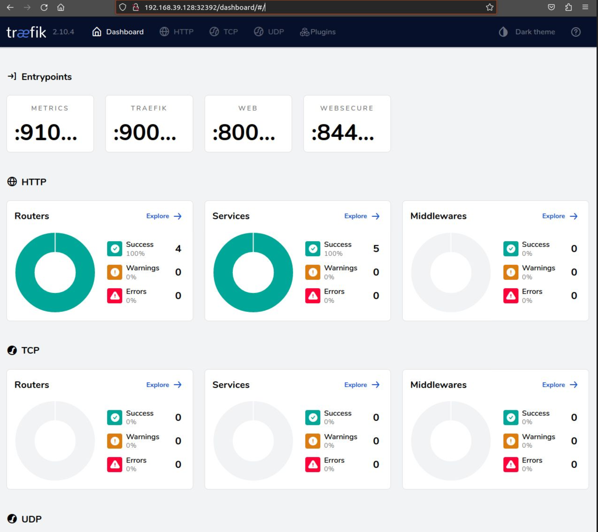

---
title: "Exploring Traefik in kubernetes"
date: 2023-08-14
tags: ["Traefik", "Kubernetes", "minikube"]
showDate: true 
showTableOfContents: true 
---

## Introdutction

[Traefik](https://traefik.io/) is a HTTP reverse proxy and load balancer. In this post, we first present some useful concepts, Introduce Traefik and then proceed with a practical hands-on guide to deploying it in a Kubernetes environment.

## Understanding HTTP Reverse Proxy

Before delving into Traefik's intricacies, let's establish a solid understanding of what an HTTP reverse proxy is. Essentially, a reverse proxy serves as an intermediary server between client requests and backend servers. When a client initiates a request to access a web application, the reverse proxy forwards that request to the appropriate backend server. This mechanism offers several advantages, including:

1. **Enhanced Security:** A reverse proxy can effectively shield your network's internal structure by adding an extra layer of security, thus avoiding direct exposure of backend servers to the public internet.

2. **Optimized Load Distribution:** By steering incoming requests towards various backend services, a reverse proxy adeptly distributes the workload, preventing any single service from becoming inundated with traffic.

3. **Caching and Compression:** Reverse proxies are equipped to cache frequently accessed content, thereby alleviating the pressure on backend services and subsequently improve response times for end-users.

4. **Streamlined SSL Termination:** SSL certificates can be managed by the reverse proxy, facilitating the process of securing communications between clients and backend servers.

## Understanding Load Balancing

Load balancing stands as a strategic approach aimed at distributing incoming network traffic across multiple services. Its core objective is to fine-tune resource consumption, maximize data throughput, and minimize response latency. Load balancers function to guarantee that no individual service bears an excessive traffic load, thereby enhancing both the availability and reliability of applications.

## Introducing Traefik

Traefik has carved a niche for itself as a dynamic HTTP reverse proxy and load balancer. What truly sets Traefik apart is its innate ability to autonomously discover and configure backend services as they are rolled out. With support spanning various backends such as Docker, Kubernetes, and Mesos, Traefik's distinct features include:

1. **Seamless Service Discovery:** Traefik boasts the prowess to dynamically detect novel services and seamlessly adjust routing configurationsa trait particularly valuable in containerized and cloud-native settings.

2. **Efficient Routing and Load Balancing:** Traefik diligently routes incoming requests to suitable backend service instances, ensuring an equitable distribution of traffic.

3. **Automated SSL Management:** Traefik takes the reins in provisioning and overseeing SSL certificates from Let's Encrypt, effectively streamlining the process of enabling HTTPS for your applications.

4. **Middleware Support:** By offering a suite of middleware features including authentication, rate limiting, and URL rewriting, Traefik empowers you to integrate essential functionalities into your services.

## Deploying Traefik in Kubernetes: A Quick Start Guide using minikube

Now, let's dive into the practical aspect of using Traefik in a Kubernetes environment. Ensure you have a Kubernetes cluster up and running. To simplify the process we will use minikube here:
Follow these steps to get started:

### Installation

 ```bash
curl -LO https://storage.googleapis.com/minikube/releases/latest/minikube-linux-amd64
sudo install minikube-linux-amd64 /usr/local/bin/minikube
 ```

### setting up the cluster

Start minikube:

```bash
minikube start
```

Install [kubectl](https://kubernetes.io/docs/tasks/tools/install-kubectl-linux/) or use minikube

```bash
alias kubectl="minikube kubectl --"alias kubectl=
kubectl get nodes
NAME       STATUS   ROLES           AGE   VERSION
minikube   Ready    control-plane   24m   v1.27.3
```

When working behind a proxy make sure that `minikube ip` is in `no_proxy`.

```bash
minikube ip
192.168.39.128
export no_proxy=$no_proxy,192.168.39.0/24
```

### Install Helm

[Helm](https://helm.sh) is a package manager for Kubernetes that simplifies the deployment of applications.

```bash
curl -fsSL -o get_helm.sh https://raw.githubusercontent.com/helm/helm/main/scripts/get-helm-3
chmod 700 get_helm.sh
./get_helm.sh
```

### Install an example application

This is the application that we want to expose using Traefik we can use an Nginx webserver, see installation instructions [here](https://kubernetes.io/docs/tasks/run-application/run-stateless-application-deployment/), Or chose a wordpress deployment:

```bash
helm install my-website \ 
    --set wordpressPassword=password \
    --set mariadb.auth.rootPassword=secretpassword \
    oci://registry-1.docker.io/bitnamicharts/wordpress
```

The service is already exposed as a [LoadBalancer service type](https://kubernetes.io/docs/concepts/services-networking/service/#loadbalancer) and can be accessed using:

```bash
minikube service my-website-wordpress --https
|-----------|----------------------|-------------|-----------------------------|
| NAMESPACE |         NAME         | TARGET PORT |             URL             |
|-----------|----------------------|-------------|-----------------------------|
| default   | my-website-wordpress | http/80     | http://192.168.39.128:32376 |
|           |                      | https/443   | http://192.168.39.128:30439 |
|-----------|----------------------|-------------|-----------------------------|
```

In a browser use urls from the command above `https://192.168.39.128:30439` or `http://192.168.39.128:32376` to access the wordpress blog example:


### Install Traefik using Helm

Now to benefit from a reverse proxy we continue with deploying Traefik, run the following commands to install Traefik:

```bash
   helm repo add traefik https://helm.traefik.io/traefik
   helm repo update
   helm install traefik traefik/traefik  --set ingressRoute.dashboard.enabled=true   --set ingressRoute.dashboard.entryPoints="{web,websecure}"

```

Verify that traefik has been deployed successfully, the dashboard has been exposed using the set arguments in the helm install command above:

---
***Note***:

- Make sure to use the right traefik service node port depending on http or https traffic. (see metalLB section below to avoid that)

- Don't forget to add "/" after dashboard in the path.

---



### Expose application using traefik

Let's try a simple UC where you have mulltiple services in your cluster and you want to access them using different custom domains lets do that with our blog:

First we need to append `myblog.minikube` to /etc/hosts

```bash
minikube ip
192.168.39.128
echo "192.168.39.128 myblog.minikube" | sudo tee -a /etc/hosts
```

Create an IngressRoute for our blog:

```yaml
apiVersion: traefik.containo.us/v1alpha1
kind: IngressRoute
metadata:
  name:  myblog

spec:
  entryPoints:
    - web
  routes:
    - kind: Rule
      match: Host(`myblog.minikube`)
      services:
        - name: my-website-wordpress
          port: 80
```


In our case the application we are using is offering a secure endpoint but even if it doesn't we can rely on traefik to do that. We just need to change the entrypoint!
see [tls section](https://doc.traefik.io/traefik/https/tls/) in traefik documentation on how to configure tls

```yaml
apiVersion: traefik.containo.us/v1alpha1
kind: IngressRoute
metadata:
  name:  myblog

spec:
  entryPoints:
    - websecure
  routes:
    - kind: Rule
      match: Host(`myblog.minikube`)
      services:
        - name: my-website-wordpress
          port: 80
```
### (Optional) Use MetalLB for getting a Loadbalancer IP

You may have noticed that we are using nodeport to access the traefik service and we need to append the port with each domain, this is because we don't have a load balancer ip.
See the pending in EXTERNAL-IP. this 

```bash
kubectl get svc
NAME                   TYPE           CLUSTER-IP       EXTERNAL-IP   PORT(S)                      AGE                                                                                                              
kubernetes             ClusterIP      10.96.0.1        <none>        443/TCP                      3d23h                                                                                                            
my-website-mariadb     ClusterIP      10.99.218.197    <none>        3306/TCP                     3d22h                                                                                                            
my-website-wordpress   LoadBalancer   10.100.12.50     <pending>     80:32376/TCP,443:30439/TCP   3d22h                                                                                                            
traefik                LoadBalancer   10.108.140.180   <pending>     80:32392/TCP,443:30808/TCP   29h      
```

In minikube this can easily be fixed using MetalLB:

```bash
minikube addons enable metallb 
❗  metallb is a 3rd party addon and is not maintained or verified by minikube maintainers, enable at your own risk.                                                                                               
❗  metallb does not currently have an associated maintainer.                                                                                                                                                      
    ▪ Using image quay.io/metallb/speaker:v0.9.6                                                                                                                                                                   
    ▪ Using image quay.io/metallb/controller:v0.9.6                                                                                                                                                                
🌟  The 'metallb' addon is enabled
```
Then we need to configure a range for the Load Balancer IP here we chose (192.168.39.10-20 range):

```bash
minikube addons configure metallb
-- Enter Load Balancer Start IP: 192.168.39.10                                                                                                                                                                     
-- Enter Load Balancer End IP: 192.168.39.20                                                                                                                                                                       
    ▪ Using image quay.io/metallb/speaker:v0.9.6                                                                                                                                                                   
    ▪ Using image quay.io/metallb/controller:v0.9.6
✅  metallb was successfully configured     
```

Now we can see that Traefik get an IP we can use to access our application:

```bash
kubectl get svc
NAME                   TYPE           CLUSTER-IP       EXTERNAL-IP     PORT(S)                      AGE
kubernetes             ClusterIP      10.96.0.1        <none>          443/TCP                      4d
my-website-mariadb     ClusterIP      10.99.218.197    <none>          3306/TCP                     3d22h
my-website-wordpress   LoadBalancer   10.100.12.50     192.168.39.10   80:32376/TCP,443:30439/TCP   3d22h
traefik                LoadBalancer   10.108.140.180   192.168.39.11   80:32392/TCP,443:30808/TCP   29h
```

we can now use the service ip instead of the node ip in /etc/hosts: `192.168.39.11 myblog.minikube`

And our blog can now be reached using just the doamin name.


This is only scratching the surface of what traefik can do. check the [docs](https://doc.traefik.io/traefik/) for more advanced feature.

## Traefik Alternatives

While Traefik is a powerful tool, it's important to explore alternatives that might better suit specific use cases or preferences. Some popular alternatives to Traefik include:

1. **Nginx:** A widely used web server, reverse proxy, and load balancer known for its performance, configurability, and extensive module support.

2. **HAProxy:** A fast and reliable solution with advanced load balancing algorithms, suitable for high-traffic environments.

3. **Envoy:** A modern proxy designed for cloud-native applications, offering features like automatic service discovery and advanced load balancing.

4. **Caddy:** A lightweight web server and reverse proxy with automatic HTTPS capabilities and a simple configuration syntax.

## Conclusion

In conclusion, understanding the concepts of HTTP reverse proxies and load balancing is essential for maintaining the stability, scalability, and security of modern web applications. Traefik, along with its alternatives, provides an array of solutions to meet the diverse needs of developers and system administrators. Whether you choose Traefik or another tool, the key lies in selecting the one that aligns with your specific requirements and technical environment.
